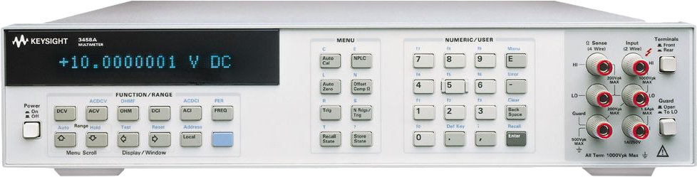
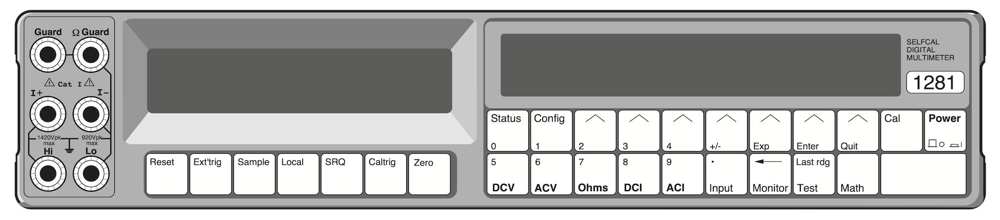

# Multimetry Cyfrowe

## Keysight 3458A

- Model: 3458A Multimeter
- Producent: Keysight Technologies
- Źródło: [Datasheet](https://www.keysight.com/zz/en/assets/7018-06796/data-sheets/5965-4971.pdf)
- Dane źródłowe (GitHub): [MACDRv1 JSON](https://github.com/ELOWRO/Meter-Accuracy/blob/main/Meters/Keysight_3458A.json)

### Transfer

#### Transfer Napięcia Stałego

##### Warunki i konfiguracja

- Rozdzielczość (Cyfry): 8.5
- NPLC: 100
- Czas nagrzania przed uzyciem (godziny): 4
- Ilość odczytów na sekundę: 0.60
- Tref ±0.5 °C 

**Maksymalny odstęp między pomiarami: 10 minuty**

| Zakres pomiarowy | Niepewność ± (ppm odczytu + ppm zakresu) |
|--:|:--:|
| 0.1000000V | 0.50 + 0.50 |
| 1.0000000V | 3.00 + 0.10 |
| 10.0000000V | 0.05 + 0.05 |
| 100.0000000V | 0.50 + 0.10 |
| 1000.0000000V | 1.50 + 0.05 |

### Wartość Absolutna

#### Napięcie Stałe
##### Warunki i konfiguracja

- Rozdzielczość (Cyfry): 8.5
- NPLC: 100
- Ilość odczytów na sekundę: 0.60
- z uzyciem ACAL
- Tacal ±1.0 °C 

**± (ppm odczytu + ppm zakresu)**

| Zakres pomiarowy | 1 dni | 90 dni | 365 dni | 730 dni |
|--:|:--:|:--:|:--:|:--:|
| 0.1000000V| 2.50 + 3.00 | 5.00 + 3.00 | 9.00 + 3.00 | 14.00 + 3.00 |
| 1.0000000V| 1.50 + 0.30 | 4.60 + 0.30 | 8.00 + 0.30 | 14.00 + 0.30 |
| 10.0000000V| 0.50 + 0.05 | 4.10 + 0.05 | 8.00 + 0.05 | 14.00 + 0.05 |
| 100.0000000V| 2.50 + 0.30 | 6.00 + 0.30 | 10.00 + 0.30 | 14.00 + 0.30 |
| 1000.0000000V| 2.50 + 0.10 | 6.00 + 0.10 | 10.00 + 0.10 | 14.00 + 0.10 |

#### Prąd Stały
##### Warunki i konfiguracja

- Rozdzielczość (Cyfry): 8.5
- NPLC: 100
- Ilość odczytów na sekundę: 0.60
- z uzyciem ACAL
- Tacal ±1.0 °C 

**± (ppm odczytu + ppm zakresu)**

| Zakres pomiarowy | 1 dni | 90 dni | 365 dni | 730 dni |
|--:|:--:|:--:|:--:|:--:|
| 0.0000001A| 10.00 + 400.00 | 30.00 + 400.00 | 30.00 + 400.00 | 35.00 + 400.00 |
| 0.0000010A| 10.00 + 40.00 | 15.00 + 40.00 | 20.00 + 40.00 | 25.00 + 40.00 |
| 0.0000100A| 10.00 + 7.00 | 15.00 + 10.00 | 20.00 + 10.00 | 25.00 + 10.00 |
| 0.0001000A| 10.00 + 6.00 | 15.00 + 8.00 | 20.00 + 8.00 | 25.00 + 8.00 |
| 0.0010000A| 10.00 + 4.00 | 15.00 + 5.00 | 20.00 + 5.00 | 25.00 + 5.00 |
| 0.0100000A| 10.00 + 4.00 | 15.00 + 5.00 | 20.00 + 5.00 | 25.00 + 5.00 |
| 0.1000000A| 25.00 + 4.00 | 30.00 + 5.00 | 35.00 + 5.00 | 40.00 + 5.00 |
| 1.0000000A| 100.00 + 10.00 | 100.00 + 10.00 | 110.00 + 10.00 | 115.00 + 10.00 |

## Wavetek 1281

- Model: Model 1281 Selfcal Digital Multimeter
- Producent: Wavetek Corporation
- Źródło: [Datasheet](https://xdevs.com/doc/Datron/1281/doc/1281_spex.pdf)
- Dane źródłowe (GitHub): [MACDRv1 JSON](https://github.com/ELOWRO/Meter-Accuracy/blob/main/Meters/Wavetek_1281.json)

### Transfer

#### Transfer Napięcia Stałego

##### Warunki i konfiguracja

- Rozdzielczość (Cyfry): 8.5
- NPLC: 1024
- Ilość odczytów na sekundę: 0.04
- T = 23.0 Tref ±1.0 °C 

**Maksymalny odstęp między pomiarami: 10 minuty**

| Zakres pomiarowy | Niepewność ± (ppm odczytu + ppm zakresu) |
|--:|:--:|
| 0.1000000V | 0.20 + 0.25 |
| 1.0000000V | 0.20 + 0.07 |
| 10.0000000V | 0.20 + 0.05 |
| 100.0000000V | 0.20 + 0.07 |
| 1000.0000000V | 0.20 + 0.05 |

#### Transfer Rezystancji 4-Wire

##### Warunki i konfiguracja

- Rozdzielczość (Cyfry): 8.5
- NPLC: 1024
- Ilość odczytów na sekundę: 0.05
- T = 23.0 Tref ±1.0 °C 

**Maksymalny odstęp między pomiarami: 10 minuty**

| Zakres pomiarowy | Niepewność ± (ppm odczytu + ppm zakresu) |
|--:|:--:|
| 10.0000000Ω | 0.20 + 1.00 |
| 100.0000000Ω | 0.20 + 0.10 |
| 1000.0000000Ω | 0.20 + 0.10 |
| 10000.0000000Ω | 0.20 + 0.10 |
| 100000.0000000Ω | 0.20 + 0.01 |
| 1000000.0000000Ω | 0.30 + 0.01 |
| 10000000.0000000Ω | 2.00 + 0.01 |
| 100000000.0000000Ω | 40.00 + 1.00 |
| 1000000000.0000000Ω | 400.00 + 1.00 |

### Wartość Absolutna

#### Napięcie Stałe
##### Warunki i konfiguracja

- Rozdzielczość (Cyfry): 8.5
- NPLC: 1024
- Ilość odczytów na sekundę: 0.04
- z uzyciem ACAL
- Tacal ±1.0 °C 

**± (ppm odczytu + ppm zakresu)**

| Zakres pomiarowy | 1 dni | 365 dni |
|--:|:--:|:--:|
| 0.1000000V| 1.00 + 0.50 | 6.00 + 0.50 |
| 1.0000000V| 0.50 + 0.20 | 3.00 + 0.20 |
| 10.0000000V| 0.50 + 0.10 | 3.00 + 0.10 |
| 100.0000000V| 1.00 + 0.20 | 6.00 + 0.20 |
| 1000.0000000V| 1.00 + 0.20 | 6.00 + 0.20 |

#### Rezystancja 4-Wire
##### Warunki i konfiguracja

- Rozdzielczość (Cyfry): 8.5
- NPLC: 1024
- Ilość odczytów na sekundę: 0.05
- z uzyciem ACAL
- T = 23.0 Tacal ±1.0 °C Tref ±1.0 °C 

**± (ppm odczytu + ppm zakresu)**

| Zakres pomiarowy | 1 dni | 365 dni |
|--:|:--:|:--:|
| 10.0000000Ω| 3.00 + 1.00 | 12.00 + 1.00 |
| 100.0000000Ω| 1.50 + 0.30 | 8.00 + 0.30 |
| 1000.0000000Ω| 1.00 + 0.30 | 6.00 + 0.30 |
| 10000.0000000Ω| 1.00 + 0.30 | 6.00 + 0.30 |
| 100000.0000000Ω| 1.00 + 0.30 | 6.00 + 0.30 |
| 1000000.0000000Ω| 2.00 + 0.70 | 10.00 + 0.70 |
| 10000000.0000000Ω| 4.00 + 4.00 | 20.00 + 4.00 |
| 100000000.0000000Ω| 30.00 + 45.00 | 200.00 + 45.00 |
| 1000000000.0000000Ω| 300.00 + 450.00 | 2000.00 + 450.00 |
